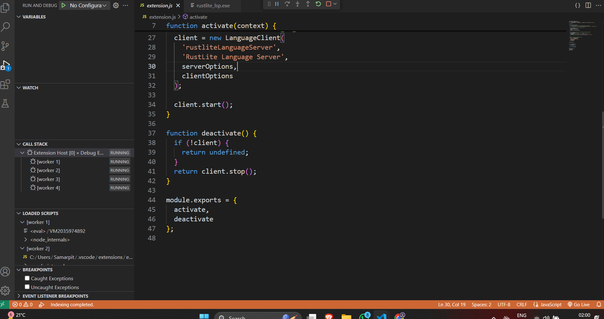
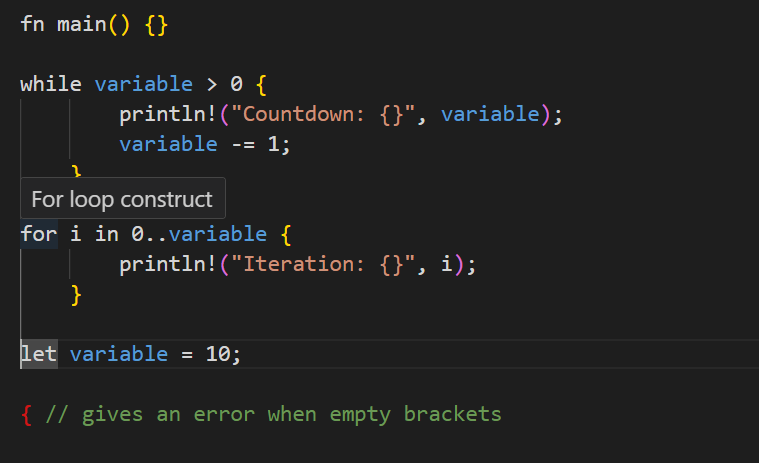

# **RustLite-LSP**  
🚀 A **Lightweight Language Server Protocol (LSP) for RustLite**, a toy domain-specific language (DSL), with **VS Code extension support**.


---

## 📌 **Core Features**
✔️ **Go to Definition** – Jump to function or variable definitions.  
✔️ **Find References** – Locate all occurrences of a symbol.  
✔️ **Hover Tooltips** – Show documentation or metadata on hover.  
✔️ **Auto-completions** – Suggest function or variable names as the user types.  
✔️ **Syntax Highlighting** – Apply colors to keywords, strings, and comments.  

### 🌟 **Stretch Goals (Nice-to-Have)**
🔹 **Code Snippets** – Quick insertions for common patterns.  
🔹 **Refactoring Support** – Safe renaming of variables/functions.  
🔹 **Performance Optimizations** – Improve parsing speed and memory efficiency.  

---

## 📂 **Project Structure**
```
vscode-extension/
│── package-lock.json      # Dependency lock file
│── server/                # Language Server executable
│   ├── rust_lite.exe      # Compiled LSP binary
│── syntaxes/              # Syntax highlighting rules
│── extension.js           # Main extension activation file
│── language-configuration.json # Language settings
│── package.json           # Extension metadata
│── node_modules/          # Installed dependencies
│── out/                   # Compiled output files

rustlite_lsp/
│── .gitignore             # Ignore unnecessary files
│── Cargo.lock             # Rust dependency lock file
│── Cargo.toml             # Rust package metadata
│── target/                # Compiled Rust language server binaries
│── src/                   # Rust language server source code
```

---

## 🔧 **Installation**
### **1️⃣ Clone & Setup**
```sh
git clone https://github.com/yourusername/RustLite-LSP.git
cd RustLite-LSP
npm install
```

---

## 🚀 **Running the Extension**
### **1️⃣ Open the Project**
```sh
code .
```
### **2️⃣ Start Debugging**
- Press **`F5`** → opens a new **VS Code instance** with the extension.
- Open a `.rlite` file and test features.



---

## 🛠 **How It Works**
🔹 **`extension.js`** → Activates the extension & starts the LSP server.  
🔹 **`server/rust_lite.exe`** → The Rust-based LSP server binary.  
🔹 **`syntaxes/`** → Stores syntax highlighting rules.  
🔹 **`target/` folder** → Stores generated `.vsix` packages for local installation.  

---

## 🎯 **Building & Generating `target/` Folder**
### **1️⃣ Install `vsce`**
```sh
npm install -g vsce
```
### **2️⃣ Build the Extension**
```sh
vsce package
```
Creates `target/rustlite-vscode-extension-1.0.0.vsix`.

### **3️⃣ Install Locally**
```sh
code --install-extension target/rustlite-vscode-extension-1.0.0.vsix
```

---

## 🏆 **Testing**
- Open a `.rlite` file.  
- Type `fn`, `let`, or `return` → check auto-completion.  
- Hover over keywords → see tooltips.  

Example `.rlite` file:
```rlite

fn main() {}

while variable > 0 {
        println!("Countdown: {}", variable);
        variable -= 1;
    }

for i in 0..variable {
        println!("Iteration: {}", i);
    }

let variable = 10;

{ // gives an error when empty brackets
```


---

## 📢 **Publishing to VS Code Marketplace**
### **1️⃣ Login**
```sh
vsce login your-publisher-name
```
### **2️⃣ Publish**
```sh
vsce publish
```

---

## 🎯 **Outcome**
✅ Proves understanding of **LSP internals, Rust, and VSCode extensions**.  
✅ Demonstrates ability to **optimize memory & CPU usage for an LSP**.  
✅ Shows practical knowledge of **AST/CST handling, useful for Sprocket LSP**.  

---

## 🤝 **Contributing**
Feel free to **fork**, submit **issues**, or create **pull requests**!

---

## 📜 **License**
MIT License  

---

🚀 This version is fully aligned with your **RustLite-LSP** project plan! Let me know if you need further refinements. 😊

